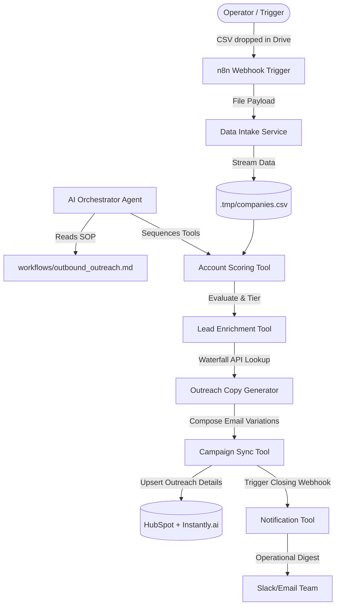

# CoreAI Outbound System

CoreAI Outbound System is an automated, event-driven internal outbound engine designed to identify, score, enrich, and launch outreach campaigns targeting local service SMBs (HVAC, plumbing, roofing, medical, legal) that spend marketing dollars but lack live/automated speed-to-lead response channels.

---

## Conceptual Architecture

The system is built on a modular Workflows, Agents, and Tools separation:



- **Workflows:** Plain-English SOPs defining operational logic (`workflows/`).
- **Agents:** Coordination layer managing tool executions.
- **Tools:** Deterministic Python modules executing specific functions (`tools/`).

---

## Directory Layout

```text
CoreAI Outbound System/
├── .tmp/                         # Temporary storage for run assets (gitignored)
├── tools/                        # Deterministic Executable Scripts
│   ├── fetch_latest_leads.py     # Real-time multi-file webhook listener and drive downloader
│   ├── score_accounts.py        # Landing page analyzer and tier classifier
│   ├── enrich_leads.py           # Waterfall email enrichment client (Saleshandy -> Explorium -> Deepline)
│   ├── deploy_campaign.py        # CRM sync & Outreach deployment client
│   └── send_notification.py      # Slack webhook notification team script
├── workflows/                    # Actionable SOP Workflows
│   └── outbound_outreach.md      # Main orchestration SOP
├── .env                          # Configuration file for API credentials
├── GEMINI.md                     # WAT framework instructions
├── scoring-criteria.md           # Business tier definitions & weights
└── copy-framework.md             # Conversion-focused outreach constraints & cold email structure
```

---

## Getting Started

### 1. Prerequisites
- Python 3.8+
- Create a virtual environment and install dependencies:
  ```bash
  pip install python-dotenv google-api-python-client google-auth-httplib2 google-auth-oauthlib
  ```

### 2. Configure Environment Variables
Fill in your API credentials inside the `.env` file at the root of the project.

### 3. Run the Webhook Intake Server
Start the HTTP server to catch incoming payloads:
```bash
python tools/fetch_latest_leads.py
```

### 4. Execute the Outreach Pipeline
To run the automated pipeline sequentially:
```bash
# 1. Fetch leads (manual run or auto-triggered)
python tools/fetch_latest_leads.py <gdrive_file_id>

# 2. Score target accounts
python tools/score_accounts.py

# 3. Enrich lead contact information
python tools/enrich_leads.py

# 4. Generate copy and sync campaign
python tools/deploy_campaign.py

# 5. Send operational digest Slack alert
python tools/send_notification.py
```
